Vaadin7 Spring Application to Vaadin23 using MPR 
======================

This project contains the source code for the tutorial for using MPR to migrate a spring boot, Vaadin7 application to a Spring boot, Vaadin 23 application.

## Running the project from command line

Run `mvn clean install spring-boot:run` in the project root directory. After the server has started point your browser to [http://localhost:8080](http://localhost:8080) to see the resulting application.

## Updating the pom.xml
#####1. Update spring-boot-starter-parent version 
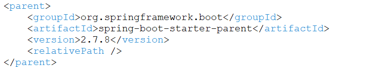

#####2. Add two different Vaadin versions to the <properties>

#####3. Update Vaadin-bom version and add jna to <dependencyManagement>
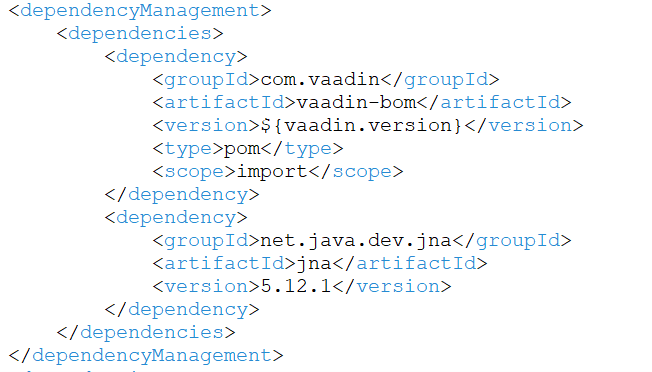

#####4. Add vaadin-server, vaadin-theme dependency with version7 and exclude gwt dependency from vaadin-server
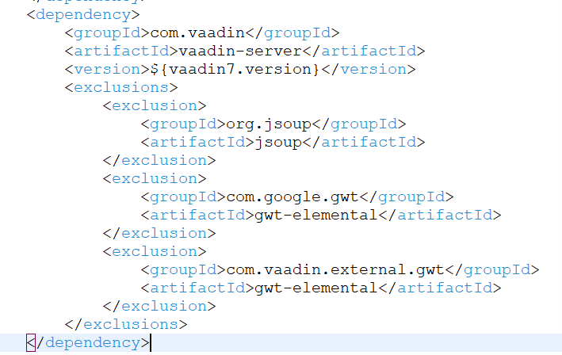

#####5. Add vaadin-client AND vaadin-client-compiler with version7(exclude gwt-elemental dependency) 

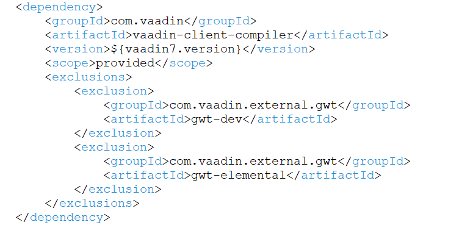

#####6. Add vaadin-core dependency and exclude gwt-elemental dependency
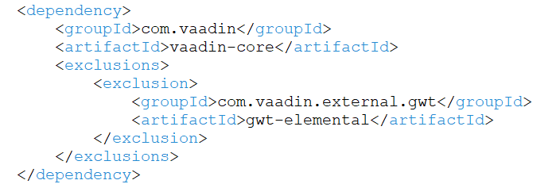

#####7 Add mpr-V7 dependency
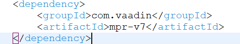

#####8 Add dependencies for gwtelemental, gw+dev and gwt+user and version should be 2.8.2
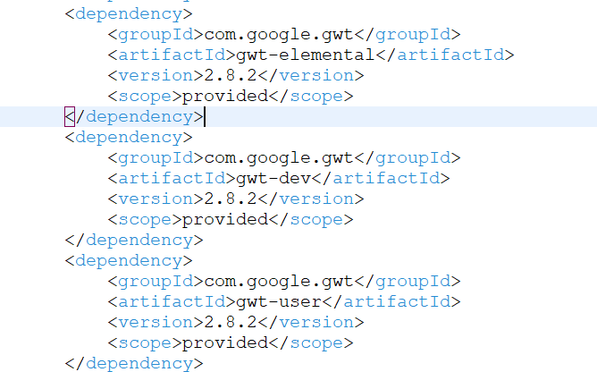

#####9 Add vaadin-maven-plugin with version7 and delete <goal>compile</goal>
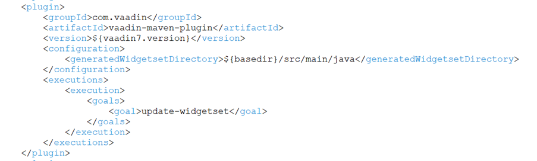

#####10 Add gwt-maven-plugin to compile the Widgetset
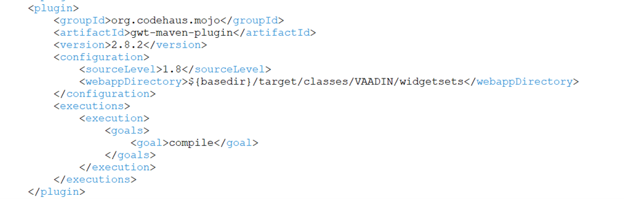

#####11 Add flow-maven-plugin to generate frontend
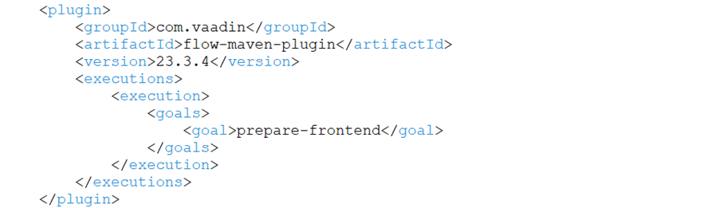

#####12. Add maven-jar-plugin
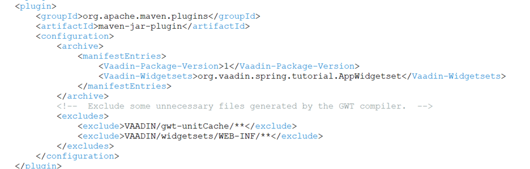

run mvn clean install and on success there should be a file  AppWidgetset in \target\classes\VAADIN\widgetsets

